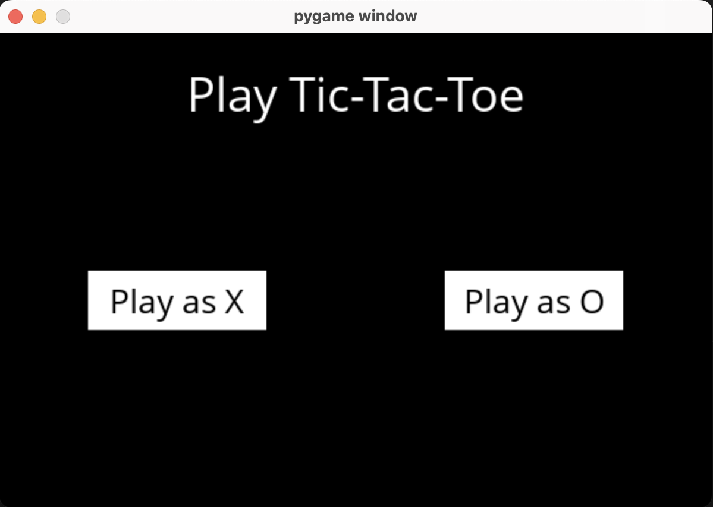
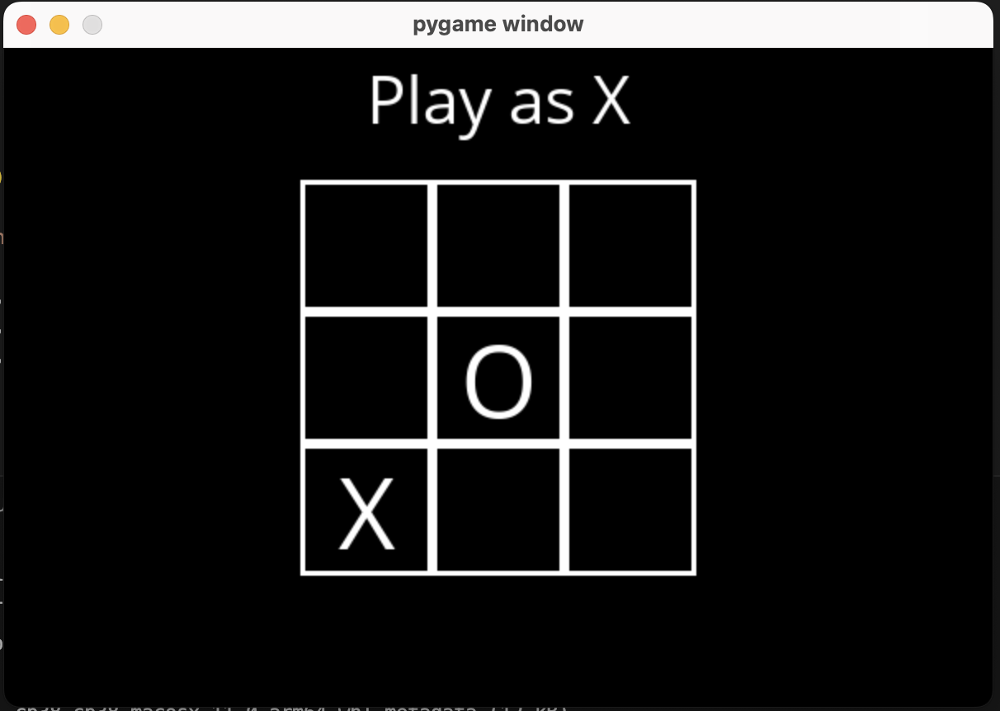
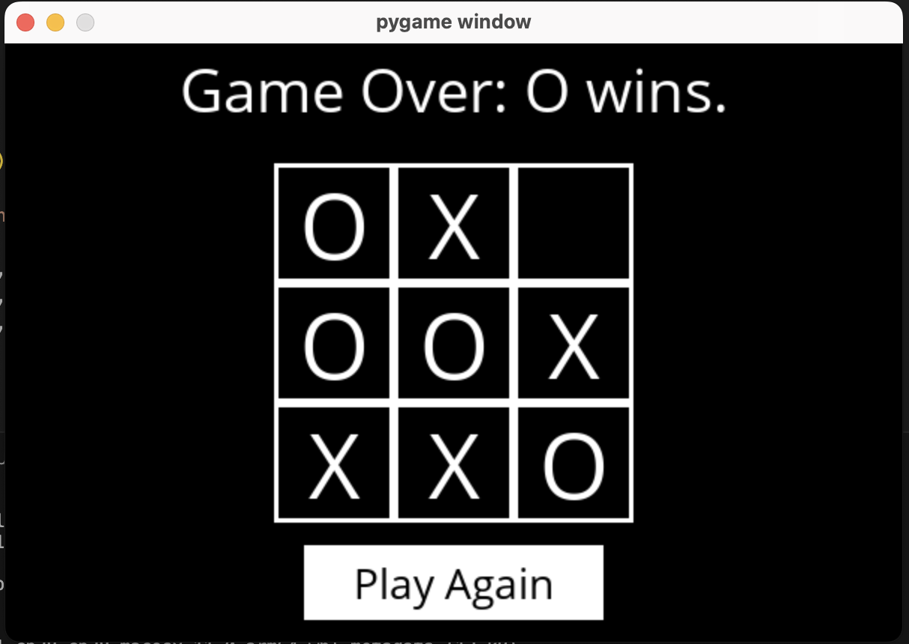

# 🎮 Tic-Tac-Toe AI

An unbeatable AI agent that plays Tic-Tac-Toe using the **Minimax algorithm**. This project implements the core logic of the game and an optimal decision-making process for playing as X or O. Run the game using a graphical interface and test your strategy against the AI!

## 📸 Result Example

Here’s an example of the game interface:




## 🧠 Overview

This project consists of two main Python files:

* ```tictactoe.py``` — Contains all logic for playing the game and computing optimal moves.
* ```runner.py``` — A GUI-based game runner provided for you. Once your logic is complete, run this file to play!

The game board is represented as a 3x3 list of lists, where each cell is either:

* ```X``` — Player X
* ```O``` — Player O
* ```EMPTY``` — An empty cell

## 📋 Specification

The core gameplay and AI logic are implemented in ```tictactoe.py```, including the following functions:

🔁 **```player(board)```**
Returns whose turn it is — X or O.

🎯 **```actions(board)```**
Returns a set of all possible actions (i, j) on the board.

📥 **```result(board, action)```**
Returns a new board with the move applied. Raises an exception for invalid actions. Must not modify the original board (use deep copy).

🏆 **```winner(board)```**
Returns the winner of the game: X, O, or None.

🛑 **```terminal(board)```**
Returns True if the game is over (either win or tie), False otherwise.

📈 **```utility(board)```**

Returns the utility of the board:

* ```1``` if ```X``` wins
* ```-1``` if ```O``` wins
* ```0``` if tie
Only valid if ```terminal(board)``` is ```True```.

🧮 **```minimax(board)```**
Returns the optimal action (i, j) for the current player using the Minimax algorithm.

* If the game is over, returns ```None```.
* If multiple moves are equally optimal, any one may be returned.

## ▶️ Running the Game

After implementing all the required functions, run the GUI with:
```
python runner.py
```
You'll play against the AI. Since Tic-Tac-Toe is a solved game, you cannot beat the AI — it will always win or force a tie.
